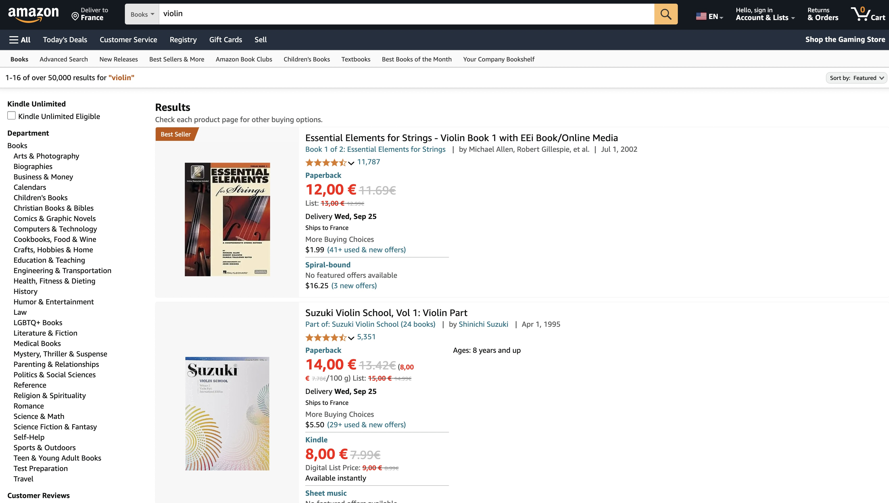

# Amazon Price Rounder

Amazon Price Rounder is a Chrome extension that helps users see beyond common pricing tactics by rounding up prices on Amazon to the nearest whole number. It displays both the rounded-up price and the original price, allowing for easier price comparisons and decision-making.

## Features

- Rounds up all prices on Amazon product pages to the nearest whole number
- Displays the rounded price in red for easy visibility
- Shows the original price struck through in gray
- Works across various Amazon domains (.com, .fr, .de, .co.uk, .it, .es)
- Updates prices dynamically as you browse

## Screenshot

## Installation

1. Clone this repository or download the ZIP file and extract it.
2. Open Google Chrome and navigate to `chrome://extensions/`.
3. Enable "Developer mode" in the top right corner.
4. Click "Load unpacked" and select the directory containing the extension files.
5. The Amazon Price Rounder extension should now be installed and active.

## Usage

Simply browse Amazon as you normally would. The extension will automatically round up prices and display them in red, with the original price shown struck through in gray.

## Contributing

Contributions are welcome! Please feel free to submit a Pull Request.

## License

This project is licensed under the MIT License - see the [LICENSE](LICENSE) file for details.

## Disclaimer

This extension is not affiliated with, endorsed by, or in any way officially connected with Amazon.com, Inc. or any of its subsidiaries or affiliates. The official Amazon website can be found at www.amazon.com. The name "Amazon" as well as related names, marks, emblems and images are registered trademarks of Amazon.com, Inc.

## Support

If you encounter any issues or have any questions, please open an issue on this GitHub repository.